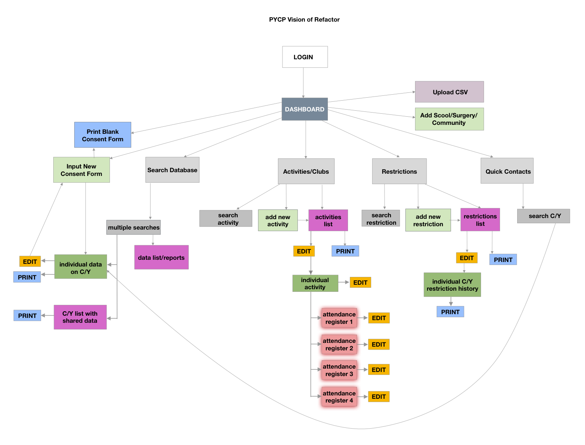

# Code Clan Client Experience

Since completing my studies at CodeClan, I have been using my new skills to continue development on an administration application for a local youth club.

The application will track attendance and store inforamtion about the service users. Critical information such as:

- Name, age and address of the service user
- Allergies
- Parent/guardian contact details
- Emergency contact
- GP details

